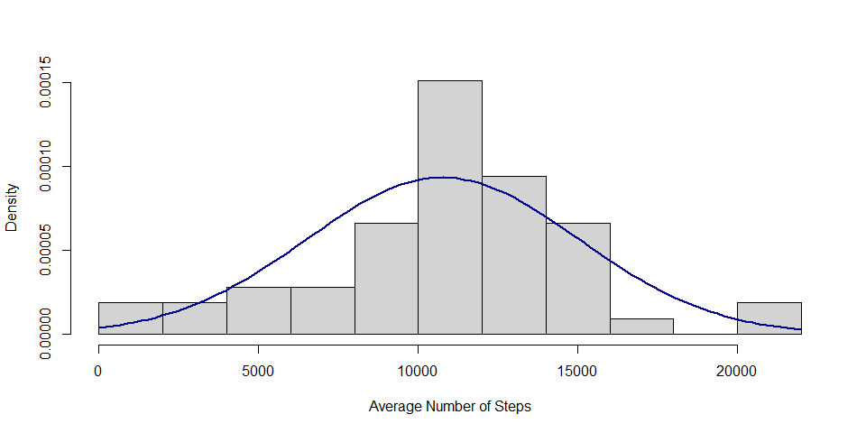
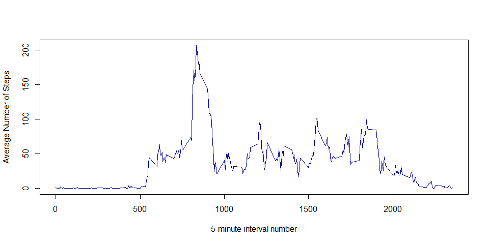
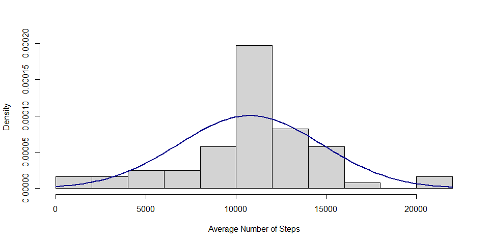
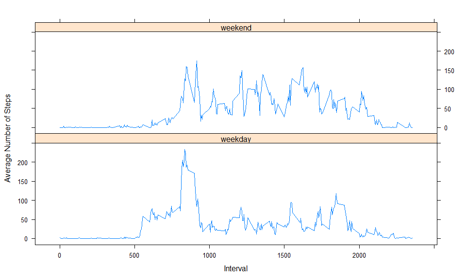

# Reproducible Research: Peer Assessment 1


## Loading and preprocessing the data
This code presumes you have set the working directory using setwd() to the directory which contains the file "activity.csv".

```r
dat <- read.csv("activity.csv")
```

## What is mean total number of steps taken per day?
First step is to remove all NA's using this code

```r
dat2 <- na.omit(dat)
```
Next we will aggregate the data into daily sums, remove NAs which result from dates with no data, and relabel columns.  Then we draw a histogram. Add a bell curve for flair.

```r
y <- na.omit(as.data.frame(tapply(dat2$steps, dat2$date, sum)))
colnames(y) <- c("Average_Number_of_Steps")
par(ps=12, oma=c(0,0,0,0))
m <- mean(y$Average_Number_of_Steps)
std <- sqrt(var(y$Average_Number_of_Steps))
hist(y$Average_Number_of_Steps, prob=TRUE, breaks=10, col="lightgray", ylab="Density", xlab="Average Number of Steps", main="")
curve(dnorm(x, mean=m, sd=std), col="darkblue", lwd=2, add=TRUE, yaxt="n")
```

 
Finally, we will calculate the mean and median of this dataset.

```r
mean(y$Average_Number_of_Steps); median(y$Average_Number_of_Steps)
```

```
## [1] 10766.19
```

```
## [1] 10765
```

## What is the average daily activity pattern?
First, average all data by the 5-minute interval across all days, and then plot a time series graph.

```r
interval.avg <- na.omit(as.data.frame(tapply(dat2$steps, dat2$interval, mean)))
colnames(interval.avg) <- c("Avg_Steps")
plot(row.names(interval.avg), interval.avg$Avg_Steps, type="l", ylab="Average Number of Steps", xlab="5-minute interval number", col="darkblue")
```

 
Now, determine which interval has the highest step count and return the interval number.

```r
m=max(interval.avg$Avg_Steps)
max.step.interval <- subset(interval.avg, interval.avg$Avg_Steps==m)
row.names(max.step.interval)
```

```
## [1] "835"
```

## Imputing missing values
Calculate and report the number of missing values.

```r
sum(is.na(dat))
```

```
## [1] 2304
```
Now lets fill in the missing NAs.  Since we have already calculated the 5-minute averages in "interval.avg", we will substitute those numbers for each interval.  Our new dataset is called 'total'.  We will create a histogram and also calculate mean and median.

```r
total <- merge(dat, interval.avg, by.x="interval", by.y="row.names")
total$steps[is.na(total$steps)] <- total$Avg_Steps[is.na(total$steps)]
```

Now, steal code from above to total the number of steps each day, draw a histogram, and calculate mean and medians.

```r
y2 <- as.data.frame(tapply(total$steps, total$date, sum))
colnames(y2) <- c("Average_Number_of_Steps")
par(ps=12, oma=c(0,0,0,0))
m <- mean(y2$Average_Number_of_Steps)
std <- sqrt(var(y2$Average_Number_of_Steps))
hist(y2$Average_Number_of_Steps, prob=TRUE, breaks=10, col="lightgray", ylab="Density", xlab="Average Number of Steps", main="")
curve(dnorm(x, mean=m, sd=std), col="darkblue", lwd=2, add=TRUE, yaxt="n")
```

 

```r
mean(y2$Average_Number_of_Steps); median(y2$Average_Number_of_Steps)
```

```
## [1] 10766.19
```

```
## [1] 10766.19
```
Based on our method of substitution, the mean estimate of the dataset did not change with the substitution, but the median estimate was brought closer to the mean estimate.

## Are there differences in activity patterns between weekdays and weekends?

First, add weekday column to dataset.  Then, fill the dat2 data frame with the average steps for each interval.

```r
require(reshape2)
```

```
## Loading required package: reshape2
```

```r
wd <- weekdays(as.Date(dat$date))
wd[wd=="Saturday"] <- "weekend"
wd[wd=="Sunday"] <- "weekend"
wd[!wd=="weekend"] <- "weekday"
dat <- cbind(dat, wd)
dat2 <- na.omit(dat)
dat3 <- as.data.frame(tapply(dat2$steps, list(dat2$interval, dat2$wd), mean, simplify=FALSE))
dat3$interval <- row.names(dat3)
row.names(dat3) <- NULL
dat3$weekday <- as.numeric(dat3$weekday)
dat3$weekend <- as.numeric(dat3$weekend)
dat3$interval <- as.numeric(dat3$interval)
dat3 <- melt(dat3, id="interval")
```
Now, use the lattice package to plot the time series.

```r
require(lattice)
```

```
## Loading required package: lattice
```

```r
xyplot(value~interval | variable, dat3, type="l", layout=c(1,2), ylab="Average Number of Steps", xlab="Interval", xaxs="r")
```

 

